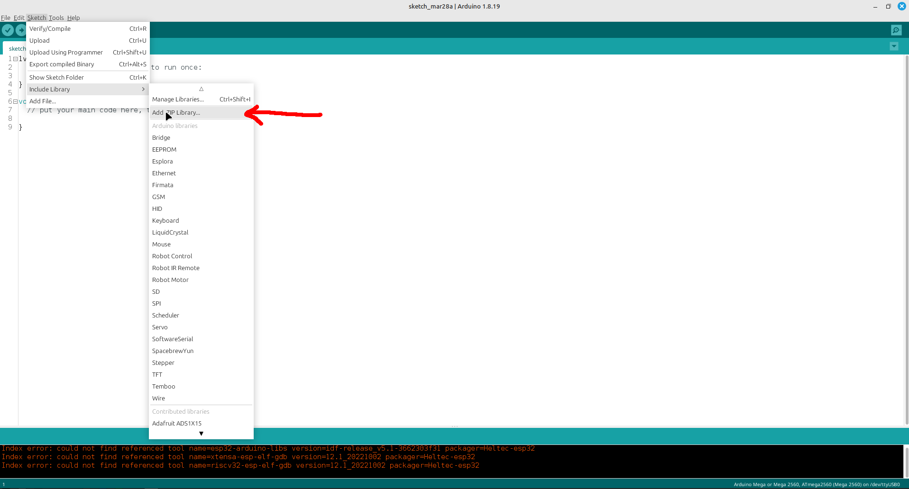
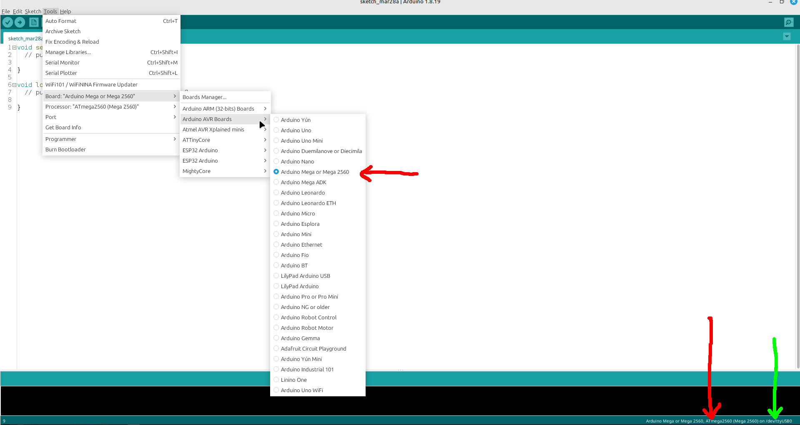

# 春 Bot

## Este proyecto tiene dos bloques:

### Mando
- **3D**: modelos 3D del mando
- **Codigo**: Ejemplos de código para el mando
- **PCB**: Diseños de la placa

### Robot
- **3D**: modelos 3D del robot
- **Codigo**: Ejemplos de código para el robot
- **PCB**: Diseños de la placa

## Instalación de las librerías:

Una vez se abra el menú, cargar las librerías que se encuentran en este proyecto.
La carpeta donde se encuentran las librerías a instalar es "LibreriasArduino".

---

## Elegir microcontrolador:

La flecha roja muestra en todo momento qué placa tenemos seleccionada, la verde indica qué puerto USB será usado para programar el microcontrolador.