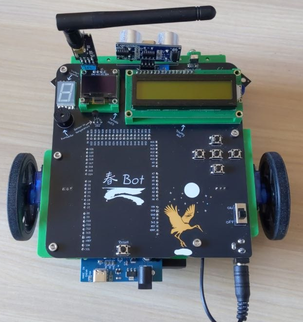

# 春 Bot

## Contenido:

- PCB: Diseño de la PCB, tanto esquemáticos como la propia PCB ( Kicad )
- 3D: Modelos 3D ( FreeCAD )
- Codigo: Contiene códigos de ejemplo ( Arduino Mega 2560 )

## Pines:

|     Uso      | Pin |                                  Uso                                  |
| :----------: | :-: | :-------------------------------------------------------------------: |
|    Faros     | A14 |      Controla un mosfet que enciende y apaga los focos frontales      |
|              |     |                                                                       |
| Temperatura  | A15 |              Sensor de temperatura. Acepta TMP36 y LM35               |
|              |     |                                                                       |
|  Pulsadores  | A8  |                            Pulsador abajo                             |
|  Pulsadores  | A9  |                           Pulsador derecha                            |
|  Pulsadores  | A10 |                          Pulsador central/ok                          |
|  Pulsadores  | A11 |                          Pulsador izquierda                           |
|  Pulsadores  | A12 |                            Pulsador arriba                            |
|              |     |                                                                       |
|    Radio     | D18 |    Módulo radio NRF24L01, pin de interrupción. ( no implementado )    |
|    Radio     | D50 |                  Módulo radio NRF24L01, pin SPI MISO                  |
|    Radio     | D51 |                  Módulo radio NRF24L01, pin SPI MOSI                  |
|    Radio     | D52 |                  Módulo radio NRF24L01, pin SPI SCK                   |
|    Radio     | D53 |                  Módulo radio NRF24L01, pin SPI #CNS                  |
|    Radio     | D43 |                   Módulo radio NRF24L01, pin SPI CE                   |
|              |     |                                                                       |
| Siguelíneas  | D23 |           Sensor izquierdo exterior del seguidor de líneas            |
| Siguelíneas  | D41 |           Sensor izquierdo interior del seguidor de líneas            |
| Siguelíneas  | D42 |            Sensor derecho exterior del seguidor de líneas             |
| Siguelíneas  | D45 |            Sensor derecho interior del seguidor de líneas             |
|              |     |                                                                       |
| Display16x2  | D33 |                        Data 4 ( bus de datos )                        |
| Display16x2  | D35 |                        Data 5 ( bus de datos )                        |
| Display16x2  | D37 |                        Data 6 ( bus de datos )                        |
| Display16x2  | D39 |                        Data 7 ( bus de datos )                        |
| Display16x2  | D31 |                                Enable                                 |
| Display16x2  | D29 |                                  RS                                   |
| Display16x2  | D27 |      Controla un mosfet que enciende y apaga la luz del display       |
|              |     |                                                                       |
| Display7seg  | D17 |                              Segmento A                               |
| Display7seg  | D25 |                              Segmento B                               |
| Display7seg  | D16 |                              Segmento C                               |
| Display7seg  | D15 |                              Segmento D                               |
| Display7seg  | D14 |                              Segmento E                               |
| Display7seg  | D22 |                              Segmento F                               |
| Display7seg  | D24 |                              Segmento G                               |
|              |     |                                                                       |
|     OLED     | D20 |                   SDA, bus I2C de la pantalla OLED                    |
|     OLED     | D21 |                   SCL, bus I2C de la pantalla OLED                    |
|              |     |                                                                       |
|    Servos    | D8  |               Servo izquierdo. Usa PWM para su control                |
|    Servos    | D12 |                Servo derecho. Usa PWM para su control                 |
|    Servos    | D6  |                Servo extra 1. Usa PWM para su control                 |
|    Servos    | D7  |                Servo extra 2. Usa PWM para su control                 |
|    Servos    | D9  |                Servo extra 3. Usa PWM para su control                 |
|    Servos    | D10 |                Servo extra 4. Usa PWM para su control                 |
|    Servos    | D11 |                Servo extra 5. Usa PWM para su control                 |
|              |     |                                                                       |
|   Zumbador   | D5  |              Control vía PWM del zumbador piezoeléctrico              |
|              |     |                                                                       |
|   Mando TV   | D4  |     Sensor infrarrojo para el mando de TV. Usa el protocolo NEC32     |
|              |     |                                                                       |
| Ultrasonidos | D3  |          Emite una señal de eco que rebota contra el objeto           |
| Ultrasonidos | D2  | Recibe la señal de eco emitida por el otro pin ( usa interrupciones ) |
|              |     |                                                                       |
